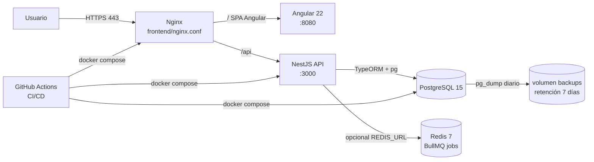
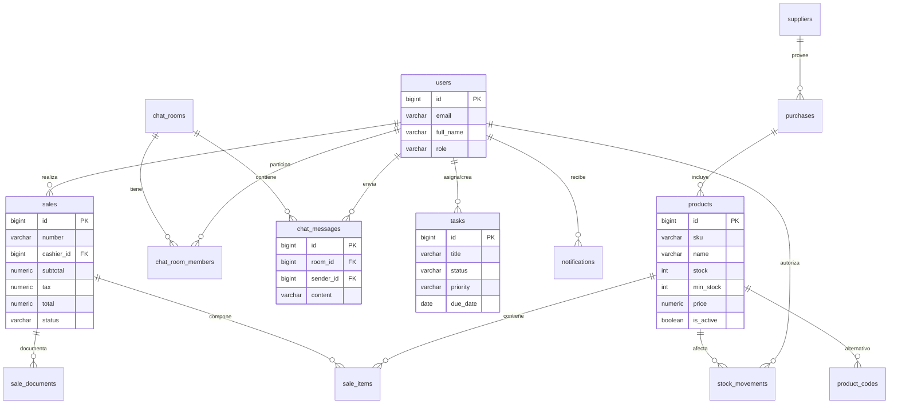
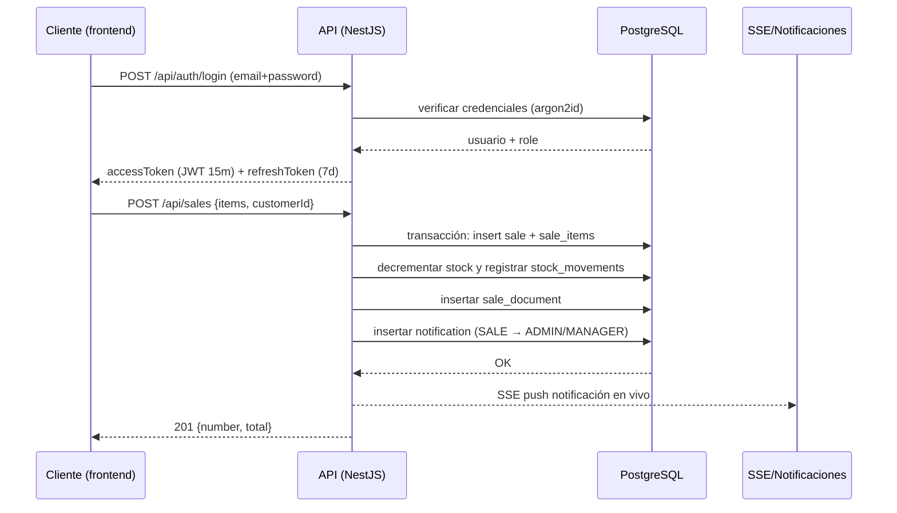
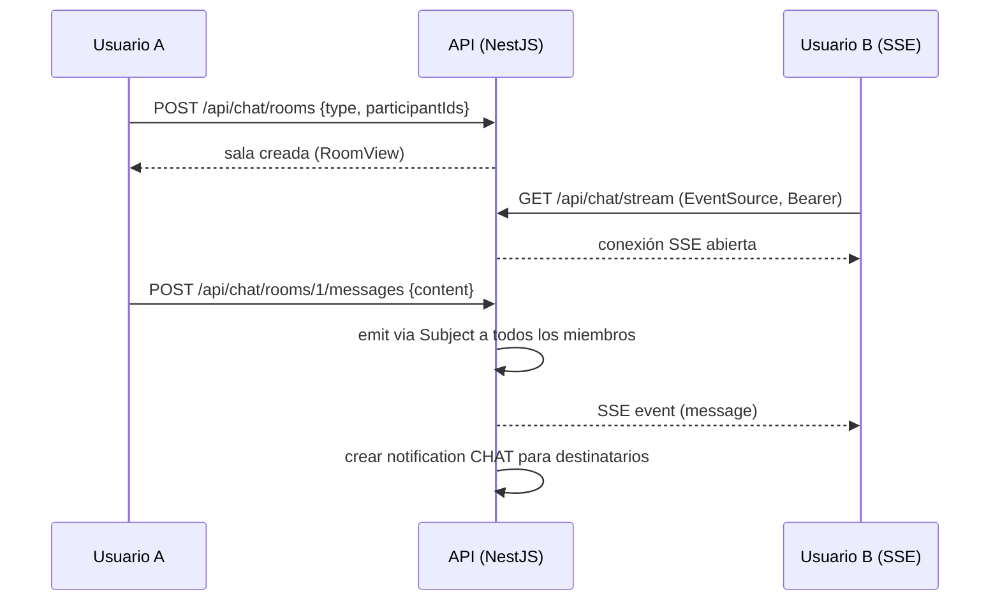

# Diagramas UML

Diagramas Mermaid del sistema de repuestos. Renderizables en GitHub, VS Code
(extensión Mermaid) o https://mermaid.live.

## 1. Arquitectura de despliegue

## 2. Diagrama de módulos del backend (NestJS)

```mermaid
flowchart TD
    App[AppModule] --> Auth[AuthModule]
    App --> Users[UsersModule]
    App --> Catalog[CatalogModule]
    App --> Inventory[InventoryModule]
    App --> Sales[SalesModule]
    App --> Purchases[PurchasesModule]
    App --> Customers[CustomersModule]
    App --> Suppliers[SuppliersModule]
    App --> Cash[CashRegisterModule]
    App --> Accounting[AccountingModule]
    App --> Banking[BankingModule]
    App --> Hr[HrModule]
    App --> Documents[DocumentsModule]
    App --> Reports[ReportsModule]
    App --> Audit[AuditModule]
    App --> Settings[SettingsModule]
    App --> Public[PublicApiModule]
    App --> Search[SearchModule]
    App --> Export[ExportModule]
    App --> Notif[NotificationsModule]
    App --> Chat[ChatModule]
    App --> Tasks[TasksModule]
    App --> Jobs[JobsModule · BullMQ]
    App --> Cache[CacheModule · Redis/memoria]
```

## 3. Modelo de datos (entidades principales)

## 4. Secuencia: flujo de venta

## 5. Secuencia: chat interno en tiempo real

